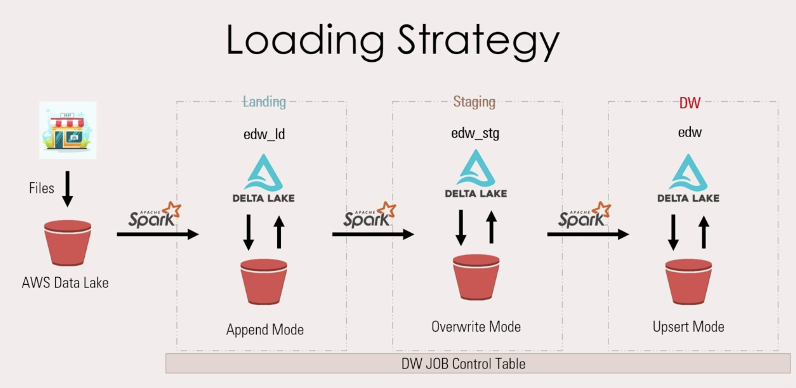

# Lakehouse ETL Pipeline (Airflow • PySpark • Delta Lake • AWS S3 • Docker)

This project implements an **end-to-end Lakehouse ETL pipeline** using **PySpark and Delta Lake** orchestrated with **Apache Airflow** inside a **Docker environment**.

The pipeline ingests raw CSV datasets, processes them through **Landing → Staging → Warehouse layers**, and builds analytical tables following **data warehousing best practices including SCD Type 1 and SCD Type 2 dimensions**.

---

# Architecture



The pipeline follows a **Lakehouse architecture** combining data lake flexibility with data warehouse reliability.

```
Raw Data (CSV)
      ↓
Landing Layer (Delta Tables)
      ↓
Staging Layer (Data Cleaning & Transformations)
      ↓
Warehouse Layer (Star Schema / Dimensional Model)
```

Orchestration is handled by **Apache Airflow**, while **Spark** performs distributed data processing.

---

# Project Structure

```
lakehouse-etl-pipeline
│
├── architecture
│   └── pipeline.png
│
├── dags
│   └── airflow.py
│
├── datasets
│   ├── customer_20220101.csv
│   └── customer_20220104.csv
│
├── docker
│   └── docker-compose.yaml
│
├── lib
│   ├── aws_s3.py
│   ├── job_control.py
│   ├── spark_session.py
│   └── utils.py
│
├── sql
│   └── init_db.ipynb
│
├── src_notebooks
│   ├── customer_landing.ipynb
│   ├── customer_staging.ipynb
│   ├── customer_warehouse.ipynb
│   ├── date_landing.ipynb
│   ├── date_staging.ipynb
│   └── date_warehouse.ipynb
│
└── requirements.txt
```

---

# Pipeline Layers

## Landing Layer
Raw data ingestion layer.

Responsibilities:

- Read CSV datasets
- Load raw data into Delta tables
- Maintain schema consistency

Implemented in:

```
customer_landing.ipynb
date_landing.ipynb
```

---

## Staging Layer

Data transformation and cleaning layer.

Responsibilities:

- Standardize schemas
- Handle null values
- Prepare datasets for dimensional modeling

Implemented in:

```
customer_staging.ipynb
date_staging.ipynb
```

---

## Warehouse Layer

Analytical data warehouse layer.

Responsibilities:

- Build dimensional tables
- Implement Slowly Changing Dimensions

Implemented in:

```
customer_warehouse.ipynb
date_warehouse.ipynb
```

---

# Slowly Changing Dimensions

### Customer Dimension — SCD Type 2

Tracks historical changes in customer attributes.

When a change occurs:

- Old record is closed
- New version is inserted with updated attributes

This allows historical analysis of customer data.

---

### Date Dimension — SCD Type 1

Overwrites existing values.

Used for reference data where historical tracking is not required.

---

# Airflow Orchestration

The pipeline is orchestrated using **Apache Airflow**.

Airflow executes the notebooks using **Papermill**, enabling notebooks to run as scheduled tasks.

Pipeline DAG:

```
Customer Pipeline
customer_landing
      ↓
customer_staging
      ↓
customer_warehouse

Date Pipeline
date_landing
      ↓
date_staging
      ↓
date_warehouse
```

---

# Docker Environment

The project runs inside Docker containers for reproducibility.

Containers used:

- **PySpark + JupyterLab container**
- **Apache Airflow container**

Docker ensures:

- consistent runtime environment
- easy setup
- dependency isolation

---

# Technologies Used

| Technology | Purpose |
|--------|--------|
| PySpark | Distributed data processing |
| Delta Lake | ACID transactions for data lake |
| Apache Airflow | Pipeline orchestration |
| Docker | Containerized development environment |
| AWS S3 | Data lake storage |
| Papermill | Automated notebook execution |

---

# Running the Project

## Start the containers

From the docker directory:

```bash
docker-compose up -d
```

---

## Access Services

### Spark / Jupyter

```
http://localhost:8888
```

### Airflow

```
http://localhost:8080
```

Login:

```
admin
admin
```

---

## Trigger the Pipeline

From Airflow UI:

1. Open DAG **lakehouse_etl_pipeline**
2. Trigger DAG
3. Monitor pipeline execution

---

# Key Data Engineering Concepts Demonstrated

This project demonstrates several real-world data engineering practices:

- Lakehouse architecture
- ETL pipeline design
- Delta Lake tables
- Slowly Changing Dimensions (SCD1 & SCD2)
- Airflow orchestration
- Docker-based environments
- Spark-based distributed processing

---

# Future Improvements

Potential extensions:

- Add streaming ingestion with Kafka
- Implement data quality checks
- Add monitoring and alerting
- Deploy pipeline on cloud infrastructure

---

# Author

**Shubhrajit Pal**

Data Engineering • Machine Learning • Distributed Systems